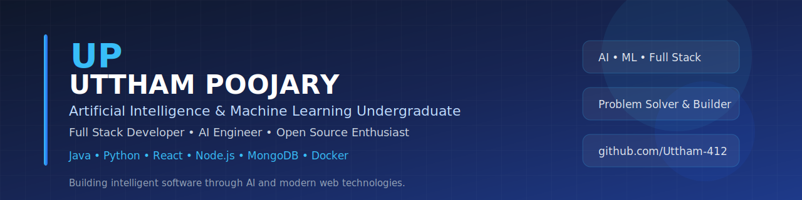

# Hi 👋, I'm **Uttham Poojary**

### Artificial Intelligence & Machine Learning Undergraduate

 

<!-- Replace with your real LinkedIn URL -->

<!-- Replace with your email -->

  

---

#  About Me

I'm an **Artificial Intelligence & Machine Learning undergraduate** passionate about building intelligent software and scalable web applications.

I enjoy combining **AI, backend development, and modern frontend technologies** to solve real-world problems through practical projects.

### 🚀 Current Focus

- 🤖 Artificial Intelligence & Machine Learning
- 💻 Full Stack Development
- 🌐 REST APIs & Backend Systems
- ☁ Cloud & DevOps Fundamentals
- 📈 Data Structures & Algorithms
- 🚀 Open Source Contributions

---

## 🎯 Currently Working On

- 🚀 CareerPath AI
- 📝 SnapNotesAI
- 🌐 Personal Portfolio
- 📚 Java DSA & LeetCode

---

## 🌱 Currently Learning

- Docker
- Kubernetes
- System Design
- CI/CD
- Cloud Computing

---

## ⚡ Quick Facts

- 🎓 AIML Undergraduate
- 💼 Interested in Software Development & AI Engineering
- 🌍 Based in India
- ☕ Coffee + Code = Productivity
- 🎯 Goal: Build impactful AI-powered products
# 🚀 Tech Stack

### 💻 Languages

  

### 🌐 Frontend

  

### ⚙️ Backend & APIs

  

### 🗄️ Databases

  

### 🤖 AI / Machine Learning

 

### 🛠️ Tools

# 📊 GitHub Analytics

 

---

# 📈 Contribution Activity

---

# 🏆 Achievements

- 🥇 Forensic Analyser Award – CYNEX CyberSiege CTF
- 🏅 IBM SkillsBuild AI Internship
- 🚀 Developed multiple AI & Full Stack projects
- 💻 Active GitHub contributor

📫 Connect With Me

<!-- Replace with your LinkedIn profile -->

<!-- Replace with your email -->

---

# 🐍 Contribution Snake

---
---

### Thanks for visiting my profile.

Building scalable software with AI, Machine Learning, and Modern Web Technologies.

---